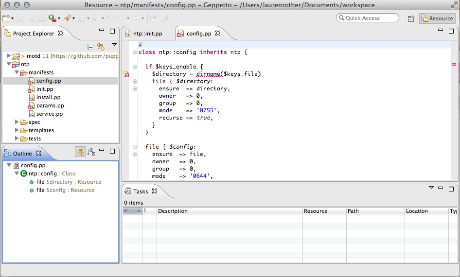
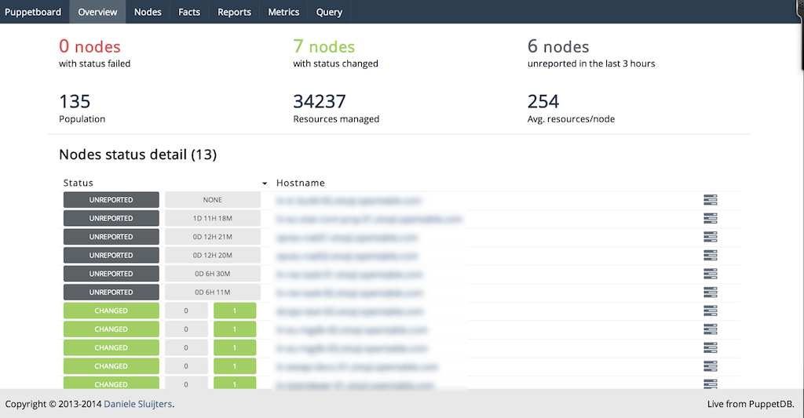

!SLIDE

# Integrating External Tools #

!SLIDE commandline incremental

## puppet lint #

    $ puppet-lint --with-filename /etc/puppet/modules
    foo/manifests/bar.pp: trailing whitespace found on line 1
    apache/manifests/server.pp: variable not enclosed in {} on line 56
    ...

!SLIDE commandline incremental

## puppet lint rake task #

    $ cat Rakefile
    require 'puppetlabs_spec_helper/rake_tasks'
    require 'puppet-lint/tasks/puppet-lint'

    PuppetLint.configuration.fail_on_warnings
    PuppetLint.configuration.send('disable_80chars')
    PuppetLint.configuration.send('disable_class_inherits_from_params_class')
    PuppetLint.configuration.send('disable_class_parameter_defaults')
    PuppetLint.configuration.send('disable_documentation')
    PuppetLint.configuration.send('disable_single_quote_string_with_variables')
    PuppetLint.configuration.send('disable_only_variable_string')
    PuppetLint.configuration.ignore_paths = ["spec/**/*.pp", "pkg/**/*.pp"]

!SLIDE code

## rspec-puppet

    @@@ruby
    require 'spec_helper'
    describe 'collectd' do
     let :facts do
       {:osfamily => 'RedHat'}
     end

     it { should contain_package('collectd').with(
       :ensure => 'installed'
     )}

     it { should contain_service('collectd').with(
       :ensure => 'running'
     )}

!SLIDE code

## rspec-puppet with conditional logic

     @@@ruby
     context 'when purge_config is enabled' do
       let :params do
         { :purge_config => true }
       end
       it { should contain_file('collectd.conf').with_content(
        /^# Generated by Puppet$/
       )}
       it { should_not contain_file_line('include_conf_d') }
     end
    end

!SLIDE commandline incremental

## Running rspec-puppet

    $ rake spec
    /u/blkperl/.rvm/rubies/ruby-1.9.3-p448/bin/ruby -S rspec spec/classes/haproxy_spec.rb spec/defines/backend_spec.rb spec/defines/balancermember_spec.rb spec/defines/frontend_spec.rb spec/defines/listen_spec.rb spec/defines/userlist_spec.rb --color
    ................................................................................
    ......................................
    Finished in 8.1 seconds
    80 examples, 0 failures

!SLIDE code

## beaker

    @@@puppet
    context "default php config" do
      it 'succeeds in puppeting php' do
        pp= <<-EOS
          class { 'apache':
            mpm_module => 'prefork',
          }
          class { 'apache::mod::php': }
          apache::vhost { 'php.example.com':
            port    => '80',
            docroot => '/var/www/php',
          }
          # other code
        EOS
        apply_manifest(pp, :catch_failures => true)
      end

!SLIDE code

## beaker

    @@@puppet
    describe service(service_name) do
      it { is_expected.to be_enabled }
      it { is_expected.to be_running }
    end

    it 'should answer to php.example.com' do
      shell("/usr/bin/curl php.example.com:80") do |r|
        expect(r.stdout).to match(/PHP Version/)
        expect(r.exit_code).to eq(0)
      end
    end

!SLIDE commandline incremental

## Running Beaker

    $ rspec spec/acceptance
    Hypervisor for centos-64-x64 is vagrant
    Beaker::Hypervisor, found some vagrant boxes to create
    created Vagrantfile for VagrantHost centos-64-x64
    Bringing machine 'centos-64-x64' up with 'virtualbox' provider...
    [...]
    [centos-64-x64] Forcing shutdown of VM...
    [centos-64-x64] Destroying VM and associated drives...

    Finished in 13 minutes 6 second

!SLIDE

## geppeto

!SLIDE

## puppetboard

!SLIDE

## puppet explorer

